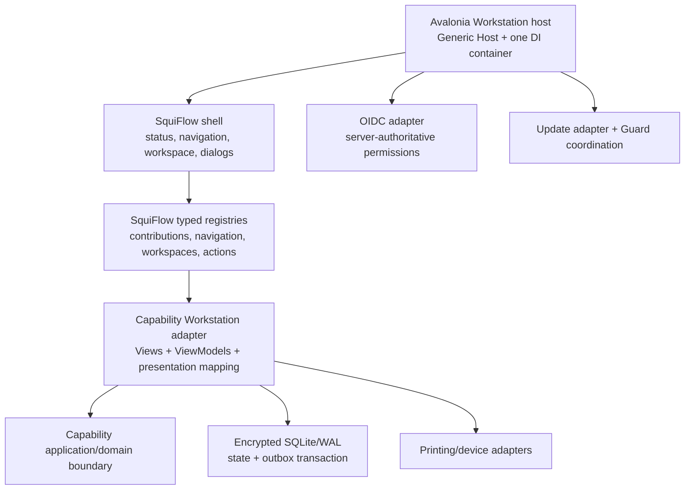

# Workstation Framework Admission Research

**Reviewed:** 2026-09-17
**Status:** source-study and admission decision; no Workstation project or runtime is currently implemented
**Input catalog:** `/home/lets-smile/Downloads/application_baseline_reference_catalog.md`
**Repository catalog copy:** `# Application Baseline, Reference Projec.md`
**Focused owner:** `docs/workstation/PRESENTATION_ARCHITECTURE.md`
**Current implementation truth:** `README.IMPLEMENTATION.md`
**Curated local sources:** `reference-sources/SOURCES.md`; source-only payloads under ignored `reference-sources/snapshots/`

## 1. Decision

SquiFlow should use a deliberately small hybrid Workstation foundation when a useful desktop slice is activated:

```text
direct foundation
  Avalonia
  CommunityToolkit.Mvvm
  Microsoft.Extensions.Hosting / DependencyInjection / Configuration /
  Logging / Options / Localization

SquiFlow-owned presentation contracts
  typed navigation, workspace, action and contribution registries
  stable IDs, ownership, availability and compatibility rules
  explicit edit/authority/sync status

focused adapters admitted by evidence
  native OIDC client
  Windows protected-secret storage
  SQLite/WAL plus durable outbox
  docking, updates, printing and devices only when their workloads are real

reference and test donors
  Prism, Eclipse RCP, NetBeans Platform, XAF, Uno.Extensions, CSLA,
  Tryton Desktop and Odoo POS/client
```

This is a hybrid of proven **behaviors**, not a stack of overlapping application frameworks. SquiFlow owns the contracts that express its product meaning. A focused package may implement a bounded technical mechanism without becoming the shell, business-object model, authorization model, sync model, module runtime, or product architecture.

All Workstation responsibilities remain `NOT_INTRODUCED`. This decision selects the route to use when a real vertical slice earns the host; it does not authorize scaffolding an empty desktop application.

License does not exclude a framework from internal research. License affects product source reuse, dependency adoption and distribution only when one of those actions is proposed.

## 2. Admission vocabulary

| Result | Meaning |
|---|---|
| **DIRECT** | Preferred package/platform for an earned responsibility, still pinned and qualified in the activating change. |
| **OWN** | Small SquiFlow contract is required because the meaning is product-specific. Use upstream tests and failure cases where useful. |
| **POC-GATED** | Plausible focused dependency, admitted only after the named proof succeeds. |
| **DONOR** | Reuse behavior, vocabulary, failure cases, test scenarios, or bounded algorithms; do not adopt the runtime. |
| **NO** | Rejected for the baseline because it conflicts with the selected platform, ownership, licensing, authority, or operational model. |

## 3. Framework and source admission

| Source | Admission | Use | Do not use | Reason |
|---|---|---|---|---|
| Avalonia | **DIRECT** | Windows desktop UI, controls, styling, compiled bindings, accessibility primitives and headless UI testing | reflection-only routing; UI as authority | It is the selected cross-platform-capable .NET presentation platform and does not require a second business runtime. |
| CommunityToolkit.Mvvm | **DIRECT** | observable presentation state, generated properties/commands, async-command state/cancellation and `ObservableValidator` | Messenger as a global business/event bus; base classes in domain models | Avalonia recommends it, it is MIT licensed, and its responsibilities remain presentation-local. |
| Microsoft.Extensions | **DIRECT** | one composition root, DI, lifetime, configuration, options, logging and localization | per-module/per-tenant containers as the default; service location; `IHostedService` as durable job storage | These are standard .NET host primitives and preserve explicit ownership. |
| Prism for Avalonia | **DONOR**, dependency **NO by default** | region/workspace navigation cases, dialog lifecycle, command availability and contribution tests | Prism application runtime, DryIoc takeover, service-locator navigation, EventAggregator business messaging, dynamic module downloading | Prism 9 uses Community/Commercial licensing and introduces an overlapping composition/navigation runtime. Reconsider only after license acceptance and an isolation POC. |
| Dock.Avalonia | **POC-GATED** | docking, floating windows and layout serialization if real workflows need them | dependency for a simple first shell; unversioned layout persistence | It is a focused MIT package, but docking creates substantial restore, lifecycle, multi-monitor and compatibility obligations. |
| Eclipse RCP | **DONOR** | semantic command IDs, handler/context separation, saveable/dirty lifecycle, jobs/progress UX, preferences and update-recovery cases | Java/SWT/OSGi runtime, extension registry, arbitrary plugin loading, service locator | Its mature workbench behavior is valuable; its runtime is a separate ecosystem and much larger than the requirement. |
| NetBeans Platform | **DONOR** | window/workspace behavior, context-sensitive actions from selection, central registration, branding and update cases | Java module system, Lookup/service locator, filesystem registry, update center | The patterns are mature, but direct adoption would replace the selected .NET/Avalonia platform. |
| XAF | **DONOR**, dependency **NO** | List/Detail vocabulary, validation summaries, action-availability explanations, layout personalization, report/scheduler UX | generated object/domain model, XAF security as product authority, ORM/UI runtime | XAF supports Blazor and WinForms rather than Avalonia, is commercial, and couples metadata, business objects, persistence, security and UI. |
| Uno.Extensions | **DONOR**, dependency **NO** | host-builder ergonomics and test cases around navigation, auth, storage and localization | Uno/WinUI navigation, host or storage packages in Avalonia | The useful base capabilities already exist through Microsoft.Extensions; the concrete packages are Uno/WinUI aligned. |
| CSLA .NET | **DONOR**, dependency **NO** | explicit dirty/new/deleted/busy/valid states, broken-rule collection, nested edit and authorization-aware action cases | `BusinessBase`, DataPortal, rules engine, serialization or authorization as the domain/application runtime | Its intrusive business-object runtime would compete with capability ownership, explicit local durability/sync and server authority. |
| Tryton Desktop | **DONOR** | permission-derived navigation, tabs/history, search/export, form/list editing and contextual actions | Python/GTK client, RPC/application runtime, source adaptation without license review | It is a useful mature operational-client reference; GPL and platform mismatch make runtime reuse unsuitable. |
| Odoo POS/client | **DONOR** | explicit online/offline capability split, session preload, connection state and offline device-continuity scenarios | browser cache as durable state, implicit synchronization, reload-sensitive recovery, application runtime | Its interaction lessons are useful. SquiFlow requires SQLite durability and state-plus-outbox atomicity stronger than browser cache. |
| Duende IdentityModel.OidcClient | **POC-GATED** | Authorization Code + PKCE through the system browser, callback handling and token protocol validation | application authorization; embedded client secret; plain token storage | It is a focused Apache-2.0 native OIDC client. SquiFlow must supply the browser adapter, OS-protected storage, session UX and server-authoritative permissions. |
| Windows Credential Manager / DPAPI | **POC-GATED OS adapter** | protect local token material and the device-side wrapping material allowed by the encryption owner | plaintext configuration; Guard as vault; sole copy of recoverable critical key material | The selected native Windows facilities avoid inventing a secret vault while preserving the existing central recovery design. |
| Velopack | **POC-GATED** | packaging, channels, differential updates and startup/update integration | automatic admission based on packaging convenience; storing mutable app data below replaced install directories | It is a focused MIT updater, but signing, rollback, Guard coordination, pending work, compatibility and failure recovery must be proven together. |

Inspected source revisions are recorded in section 12. A released dependency must still be pinned and rechecked for its license, target frameworks, advisories and transitive graph in the change that first adds it.

## 4. Functionality route

This table converts the catalog's functionality scores into SquiFlow decisions. `NOW` means part of the first useful Workstation responsibility, not permission to prebuild it before that slice exists.

| Functionality | SquiFlow mechanism | Best donors | Timing | Excluded route |
|---|---|---|---|---|
| Application shell | Avalonia host/window composed with Generic Host | Prism, RCP, NetBeans | NOW | framework-owned application runtime |
| Window/workspace system | SquiFlow workspace registry; simple content/tabs first | RCP, NetBeans, Prism | NEAR | Dock until persistent docking/floating is proven necessary |
| Navigation | stable typed navigation IDs and factories owned by the shell | Prism, Uno, Tryton | NOW | reflection-only View discovery; route strings as authority |
| Modular UI contribution | reviewed typed contributions compiled into the shipped artifact | Prism, RCP, NetBeans | NOW | folder-scanned DLLs or arbitrary extension points |
| Module lifecycle/dependencies | explicit composition while small; graph only when multiple real contributors earn it | RCP, NetBeans, Prism | NOW, smaller | application-kernel project created for symmetry |
| DI/service composition | one Microsoft.Extensions root; explicit factories/strategies for ordinary profile variation | Uno.Extensions, .NET Generic Host | NOW | DryIoc takeover, unqualified child-container forests or service locator |
| Command/action model | SquiFlow action descriptors plus Toolkit commands in ViewModels | RCP, NetBeans, Prism, XAF | NOW | commands that bypass application authorization |
| UI event/messaging | direct contracts first; narrow presentation notification when earned | Prism tests as counterexamples | EARN/local only | global EventAggregator/Messenger business bus |
| MVVM/presentation patterns | CommunityToolkit.Mvvm plus compiled Avalonia bindings | Prism, CSLA state vocabulary | NOW | framework base types in capability/domain models |
| Metadata-driven forms/grids | bounded presentation schema for a real repeated form problem | XAF, Tryton, Odoo | EARN | metadata becoming the domain model or generic CRUD generator |
| Security-aware UI | server-provided capability/permission state drives availability and explanation | XAF, Tryton | NOW | hidden controls or token claims as authorization proof |
| Validation/edit-state | `ObservableValidator` for input shape plus explicit application/business results | CSLA, XAF | NOW | duplicating authoritative business validation in ViewModels |
| Dirty/new/busy semantics | explicit presentation edit-session state | CSLA, RCP | NOW | deriving durable/sync authority from a single dirty flag |
| Authentication helpers | native OIDC adapter using system browser + PKCE; server owns authority | OIDC client, Uno auth cases | NOW | WebView password capture, native client secret, offline permission grant |
| Local settings/preferences | typed settings with versioned OS/user storage and bounded layout records | RCP, NetBeans | NOW | mixing preferences with authoritative business settings |
| Secure local secrets | narrow Windows Credential Manager/DPAPI adapter | Microsoft security guidance | NOW | custom crypto vault or plaintext configuration |
| Local DB abstraction | capability-owned local repositories/transactions over selected SQLite provider | SquiFlow local-first owners | NOW, ours | generic repository; framework business-object persistence |
| Offline-first architecture | explicit local/central authority states and allowed-offline capability policy | Odoo POS behavior cases | NOW | treating every operation as offline-capable |
| Durable sync/outbox | one SQLite transaction for local state plus semantic outbox | SquiFlow sync owner; Odoo failure cases | NOW, ours | UI event bus, in-memory queue or browser cache |
| Background jobs | bounded host service for disposable process-local work; durable work uses persisted job/outbox owner | RCP jobs/progress UX | NOW, bounded | `IHostedService` as proof of durability |
| Update lifecycle | signed version/channel compatibility plus Guard-coordinated recovery; Velopack candidate | RCP/NetBeans cases, Velopack | NEAR | self-update before signing, rollback and pending-work proof |
| Localization | `.resx`, Microsoft.Extensions.Localization and Avalonia resources | Uno, XAF | NEAR | adopting a UI framework for localization alone |
| Branding/theming | small SquiFlow tokens/resources over Avalonia theme primitives | NetBeans branding, XAF/Odoo UX | NEAR | per-module skins or copied reference-product styling |
| Reporting/printing | immutable report/input snapshot -> renderer/PDF -> Windows print adapter | XAF, Tryton, Odoo | NEAR | report engine or direct device code before a real document |
| Scheduler/calendar UI | capability-owned schedule semantics rendered by an admitted control | XAF, Tryton | EARN | scheduler control defining business recurrence/authority |
| Device/peripheral integration | narrow typed adapters with timeout, cancellation, reconnect and operator status | Odoo POS | NEAR, ours | provider SDK types in capability contracts |
| Diagnostics | Microsoft.Extensions.Logging/OpenTelemetry with local durable evidence and shell status | RCP, NetBeans | NOW | UI log console as audit or unrestricted support bundle |
| Dynamic runtime plugins | none; reviewed modules ship in the verified artifact | RCP/NetBeans supply failure lessons | NO | hot loading/unloading, tenant code or folder-drop plugins |
| Cross-platform desktop | Avalonia keeps the option; qualify the actual Windows deployment first | Avalonia | NOW via Avalonia | lowest-common-denominator UI or untested portability claims |

## 5. Owned hybrid boundary



The registry is ordinary typed composition. It is not a new application kernel, plugin runtime or service locator. With one capability contribution, explicit registration is enough. A reusable dependency graph is extracted only after multiple real contributors produce ordering, compatibility or duplicate-detection pressure.

## 6. Conceptual presentation contracts

These are responsibility sketches, not authorized types or final names:

```text
WorkstationContribution
  OwnerId
  NavigationItems
  Workspaces
  Actions
  Compatibility

NavigationItem
  NavigationId
  OwnerId
  LabelResourceKey / IconKey
  WorkspaceId
  RequiredFeature / RequiredPermission metadata

WorkspaceDefinition
  WorkspaceId
  OwnerId
  ViewModelFactory
  RestoreVersion
  CloseGuard / SaveIntent

WorkstationAction
  ActionId
  OwnerId
  LabelResourceKey
  Context predicate
  Availability explanation
  Command

EditSessionState
  IsNew / IsDirty / IsBusy / IsValid
  Validation issues
  Local authority state
  Pending/conflict/rejection evidence
```

Rules the eventual implementation must preserve:

- every stable ID has one owner and duplicates fail during composition;
- permission/feature metadata controls UX availability only; the authoritative application/server path enforces the action;
- `IsDirty` describes the current editing buffer, not local durability, remote acceptance or server authority;
- workspace restore data is versioned, bounded and safe to discard when incompatible;
- a ViewModel does not receive a container/service locator;
- dialogs, toasts and local notifications do not become cross-capability business communication.

## 7. Proof gates

### W0 — real journey and shell proof

Select one real repeated desktop journey and its focused capability owner. Build the smallest shell around that journey. Prove startup, resizing, keyboard/focus flow, stable navigation, duplicate-ID failure, one real action, one real application result, explicit authority/status display and headless UI tests. Measure cold startup and memory.

This is the point where Avalonia, CommunityToolkit.Mvvm and the required Microsoft.Extensions packages may be pinned and introduced. It must not be an empty shell or placeholder dashboard.

### Docking gate

Admit Dock.Avalonia only if the selected journey needs user-arranged simultaneous documents/panels or detached windows. The POC must cover layout schema/version migration, corrupt layout recovery, close/dirty guards, multiple monitors, DPI/scale changes, focus/keyboard behavior, crash restart, object lifetime/leaks and the selected Avalonia version. A simple navigation plus tabs/panels remains the baseline if these needs do not exist.

### Authentication gate

Qualify the selected OIDC client against ZITADEL using the system browser and Authorization Code + PKCE `S256`. Prove callback ownership, state/nonce/issuer validation, cancellation, no-browser and port-collision failure, token refresh/expiry/revocation, account change, clock skew, log redaction, OS-protected token storage and current server-side permission evaluation. The client library never grants a SquiFlow permission.

### Local durability and sync gate

Choose and qualify the SQLite/encryption provider under `LOCAL_FIRST_DESKTOP.md` and `SYNC_AND_AUTHORITY.md`. Prove one transaction commits local state and its outbox record; crash/restart cannot lose acknowledged local work; retries are semantically idempotent; WAL/journal/temp/backup files remain inside the encryption claim; conflict/rejection/authorization-change states survive restart; and central acceptance is never implied by local success.

### Update gate

Qualify Velopack or another updater with the Guard owner. Prove package/signature verification, channel and downgrade policy, incompatible local-schema handling, partial download, interrupted install, launch failure, rollback/roll-forward, safe-mode path, preserved encrypted DB/outbox/settings, old/new process exclusion and bounded diagnostic evidence. Do not keep mutable data in an install directory replaced by update.

### Device, print and report gate

Start with one real output or peripheral. Prove a provider-neutral contract, cancellation/timeouts, unavailable/reconnect behavior, duplicate-effect prevention where applicable, operator-visible state and redacted diagnostics. For printing, prefer a reproducible immutable document/PDF pipeline before direct printer-specific rendering. Select a reporting engine only when repeated report composition requirements justify it.

## 8. Implementation route

| Slice | Outcome | Admitted mechanisms | Remains absent |
|---|---|---|---|
| W0: journey qualification | one useful desktop journey, authority map and interaction prototype | source/test donors only | host, DB, sync, plugins |
| W1: thin vertical Workstation | runnable Avalonia shell plus one real capability screen/action and evidence | Avalonia, Toolkit.Mvvm, minimum Microsoft.Extensions packages, owned typed registration | docking, generic module graph, local DB unless the journey requires it |
| W2: local durable journey | encrypted local state plus atomic outbox and restart/conflict evidence | selected SQLite/encryption adapter | broad generic offline platform |
| W3: connected authority | native OIDC, current server authorization, sync/status/recovery UX | qualified OIDC and protected-secret adapters | local permission authority |
| W4: serviced desktop | signed update, Guard coordination, diagnostics and recovery | qualified updater and Guard IPC/mechanics | unproven zero-downtime or automatic rollback claims |
| W5: earned operations | docking, localization breadth, reports, calendar or device adapters required by measured workflows | only each separately qualified focused package | framework suite adoption and dynamic plugins |

Each slice must identify its exact production claim, falsifiable evidence, lasting regression guard, requalification triggers and non-claims. If an introduced responsibility cannot meet its claim, finish it or remove it; do not carry it forward as later hardening.

## 9. Rejection and exit rules

- Do not combine Prism, Uno.Extensions, CSLA and XAF runtimes. Their overlapping containers, navigation, object, validation and security models would create several owners for the same meaning.
- Do not copy Java/Python/JavaScript framework source into the .NET client. Adapt behaviors and tests under SquiFlow contracts.
- Do not select a package because its matrix column has the most dots. Select the smallest mechanism that closes the active requirement and can be removed behind a SquiFlow-owned boundary.
- Keep persisted layout, local DB, outbox, tokens and update state in SquiFlow-owned/versioned formats wherever practical. Package-specific data must have a documented migration/discard path.
- Wrap focused infrastructure at the boundary where substitution is plausible; do not create forwarding abstractions around stable Avalonia or .NET primitives merely to claim independence.

## 10. Falsifiable admission evidence

The first Workstation change must add tests that fail for the properties it claims. The expected minimum is:

- ViewModel unit tests for command execution, cancellation/busy state, validation and authority-state mapping;
- Avalonia headless tests for navigation, focus/keyboard behavior, contribution rendering and disabled/unavailable actions;
- composition tests for duplicate IDs and invalid ownership/compatibility;
- architecture tests preventing UI/provider types from entering capability contracts;
- journey-level tests for any introduced local durability, sync, authentication, update or device claim;
- package-license and pinned-version record for every direct dependency.

Snapshotting a screen or testing a mock of the same shortcut does not prove these properties.

## 11. Revisit triggers

Revisit this decision if:

- the first two real desktop journeys require region composition substantially richer than the owned typed registry;
- a Dock.Avalonia POC fails restore/lifecycle/accessibility/resource obligations or a simpler shell proves sufficient;
- Prism licensing changes or its Avalonia composition can be adopted without DryIoc/service-location ownership;
- Avalonia or a selected package no longer supports the repository's .NET baseline;
- a platform outside Windows becomes an actual supported deployment rather than an option;
- update, identity, encryption or device evidence exposes a provider assumption that cannot be isolated safely.

## 12. Sources and inspected revisions

Primary official material used for this decision:

- [Avalonia MVVM guidance](https://docs.avaloniaui.net/docs/how-to/mvvm-how-to), [dependency injection](https://docs.avaloniaui.net/docs/app-development/dependency-injection), [compiled bindings](https://docs.avaloniaui.net/docs/data-binding/compiled-bindings), [binding validation](https://docs.avaloniaui.net/docs/data-binding/binding-validation), and [headless testing](https://docs.avaloniaui.net/docs/testing/setting-up-the-headless-platform).
- [CommunityToolkit.Mvvm](https://github.com/CommunityToolkit/dotnet/tree/b135626dd54d33b8f05f2ff31591592c004aa848), inspected at `b135626dd54d33b8f05f2ff31591592c004aa848`: `ObservableValidator`, `AsyncRelayCommand`, relay-command generation and their tests; MIT.
- [Prism](https://github.com/PrismLibrary/Prism/tree/358118cd640d9a22ff8cf21c8ad197fa038b7990), inspected at `358118cd640d9a22ff8cf21c8ad197fa038b7990`, plus [region navigation documentation](https://docs.prismlibrary.com/docs/current/navigation/regions/basic-region-navigation/); Community or Commercial license.
- [Dock.Avalonia](https://github.com/wieslawsoltes/Dock/tree/cc08602d02fde1b85067cec064da29f34785e505), inspected at `cc08602d02fde1b85067cec064da29f34785e505`: dockable/factory/serialization contracts and test suites; MIT.
- [Microsoft .NET Generic Host](https://learn.microsoft.com/dotnet/core/extensions/generic-host) and [Windows secret-handling guidance](https://learn.microsoft.com/windows/win32/secbp/handling-passwords).
- [Eclipse Platform UI](https://github.com/eclipse-platform/eclipse.platform.ui), [Eclipse UI guidelines](https://github.com/eclipse-platform/ui-best-practices), and the [RCP FAQ](https://github.com/eclipse-platform/eclipse.platform.ui/blob/master/docs/Rich_Client_Platform/Rich_Client_Platform_FAQ.md); EPL-2.0.
- [Apache NetBeans Platform Maven tutorial](https://netbeans.apache.org/tutorial/main/tutorials/nbm-maven-quickstart/) and [selection/context tutorial](https://netbeans.apache.org/tutorial/main/tutorials/nbm-selection-1/); Apache-2.0.
- [DevExpress XAF supported UI platforms](https://docs.devexpress.com/eXpressAppFramework/401675/overview/supported-ui-platforms) and [security considerations](https://docs.devexpress.com/eXpressAppFramework/404691/security-considerations/general-security-considerations); commercial.
- [Uno.Extensions](https://github.com/unoplatform/uno.extensions/tree/945312137dd56f42745a58cb5c65d9e81922d659), inspected at `945312137dd56f42745a58cb5c65d9e81922d659`; Apache-2.0.
- [CSLA .NET](https://github.com/MarimerLLC/csla/tree/408c05eef72c0ffe651fac6565641c71b21d7457), inspected at `408c05eef72c0ffe651fac6565641c71b21d7457`: `BusinessBase` and related rules/edit/data-portal behavior; MIT.
- [Tryton](https://github.com/tryton/tryton) and its [desktop-client usage documentation](https://docs.tryton.org/7.0/client-desktop/usage.html); GPL-3.0.
- [Odoo Point of Sale documentation](https://www.odoo.com/documentation/19.0/applications/sales/point_of_sale.html) and [Odoo source](https://github.com/odoo/odoo); Community source LGPL-3 with separate proprietary editions.
- [Duende IdentityModel OIDC Client](https://docs.duendesoftware.com/identitymodel-oidcclient/) and its source monorepo inspected at `6eaad5d969799f3a7eb388238fecaa655c66bd19`; Apache-2.0.
- [Velopack](https://github.com/velopack/velopack/tree/275185d1b314ad9802760a2c8b79fcc14bd19070) at revision `275185d1b314ad9802760a2c8b79fcc14bd19070` and its [delta-package documentation](https://docs.velopack.io/packaging/deltas); MIT. Only repository/documentation-level review was completed; detailed local source inspection remains part of the update POC.

The configured deep-research backends were unavailable in this environment because no Parallel or OpenRouter API key was present. The review therefore used current official documentation and primary source repositories, with immutable revisions where local source inspection was completed.
